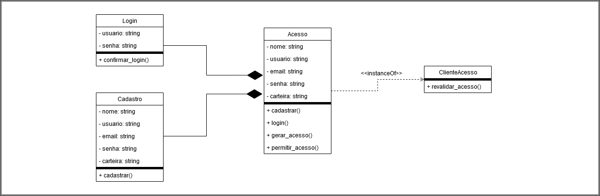
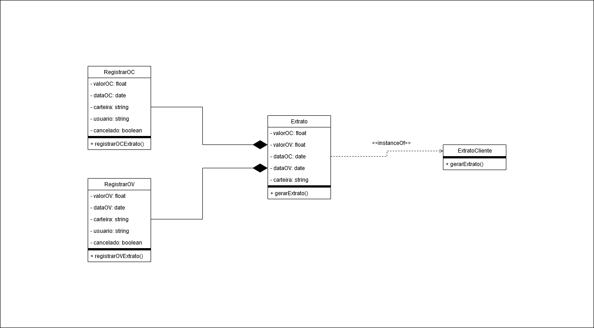
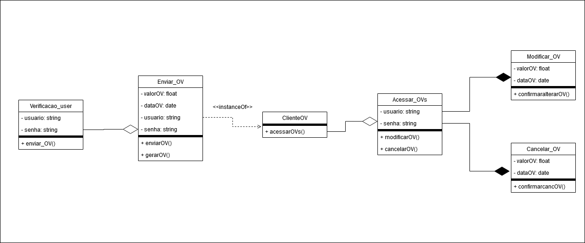

# Projeto-Soy-Stocks
Projeto de Modelagem de Software Orientado a Objeto
# DIAGRAMAS:

## Diagrama de acesso:

## Diagrama do Extrato:

## Diagrama das OCs:

## Diagrama das OVs:

## Diagrama Sequencial:
.png)
